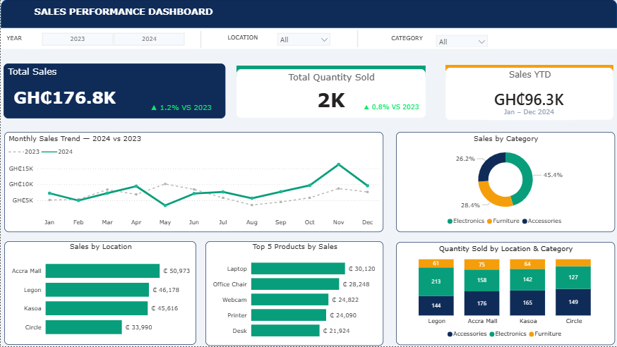

# Retail Sales Performance 

### Overview
This project is a retail sales analysis dashboard built in Power BI. It analyzes the performance of a multi-location store in Ghana across different product categories, locations, and time periods (2023 vs 2024).

The goal of this project is to provide insights into sales trends, product performance, and business growth using interactive visuals and KPIs.

### Time Intelligence Analysis
The dashboard incorporates time intelligence techniques to analyze performance over time, including:

- Year-over-Year (YoY) growth analysis  
- Monthly sales trend comparison (2023 vs 2024)  
- Identification of peak and low-performing periods  

### Business Context
The business operates across four locations:
- Accra Mall  
- Legon  
- Kasoa  
- Circle  

It sells products in three main categories:
- Electronics  
- Accessories  
- Furniture  

### Key Metrics
- Total Sales  
- Total Quantity Sold  
- Sales Growth (Year-over-Year)  
- Quantity Growth (Year-over-Year)  
- % Contribution by Category  

### Key Insights

**Overall Sales Performance:**  
The store recorded stronger performance in **2024** compared to **2023**, indicating overall business growth. This suggests improved demand, better product availability, or more effective sales strategies.

**Seasonal Sales Trends:**  
Sales peaked in **November 2024**, making it the **highest-performing month**, while **May** recorded the lowest sales. This highlights a seasonal pattern where demand increases toward the end of the year. The dip in May suggests an opportunity for targeted promotions during low-performing periods. Although 2024 generally outperformed 2023, May 2023 recorded higher sales than May 2024, indicating a performance inconsistency.

**Category Performance:**  
**Electronics** contributed the highest share of sales (45.4%), followed by Furniture (28.4%) and Accessories (26.2%). This shows that Electronics is the primary revenue driver and should be prioritized in inventory planning and marketing efforts.

**Location Performance:**  
**Accra Mall** recorded the highest sales, followed by Legon and Kasoa, while Circle had the lowest performance. This suggests that location significantly impacts sales, likely due to differences in customer traffic and demographics.

**Top-Performing Products:**  
Top-selling products include Laptop, Office Chair, Webcam, and Printer. These products demonstrate strong demand and should be prioritized for restocking and promotions.

### Dashboard Preview

---

## Product Performance Tracker

A second report page provides a detailed breakdown of product performance using a matrix table. Users can dynamically filter results by location, product, and time using slicers.

#### Includes:
- Category  
- Product Name  
- Quantity Sold  
- Total Sales  
- % of Total Sales  

### Tracker Preview

### Data Model

The project follows a structured data model:

#### ▪️ Fact Table:
- Orders (sales transactions)

#### ▪️ Dimension Tables:
- Products  
- Date Table (for time-based analysis)

### Tools & Skills Used
- Power BI  
- DAX (including Time Intelligence functions)  
- Data Modeling (Star Schema)  
- Data Visualization  
- KPI Design  

