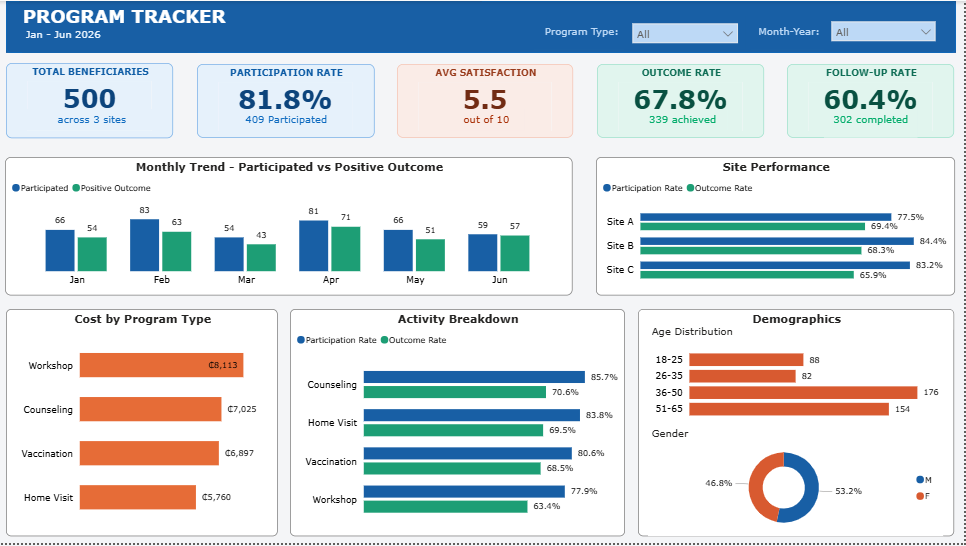

# Community Health Program Monitoring Analysis

### Overview
This project is a **community health program monitoring and evaluation dashboard** built using Power BI. It analyzes beneficiary participation, program outcomes, satisfaction levels, and resource utilization across multiple health program sites from **January to June 2026**. The model is also designed with a **date table to support automatic updates when new data is added**, ensuring it reflects the current state of the program.

The goal of this project is to provide insights into program effectiveness, service delivery performance, and beneficiary engagement using interactive KPIs and visual analytics.

### Program Context
The health program operates across three service delivery sites: **Site A, Site B** and **Site C**  

The program includes four key activity types: **Workshop**, **Counseling**, **Vaccination** and **Home Visit**  

### Key Metrics

- Total Beneficiaries: 500  
- Participation Rate: 81.8%  
- Outcome Achievement Rate: 67.8%  
- Follow-up Completion Rate: 60.4%  
- Average Satisfaction Score: 5.5 / 10  
- Total Resource Usage (Cost Proxy)  

## Key Insights

**1. Overall Performance:** The program recorded a strong participation rate of **81.8%**, indicating high engagement across all service sites. The outcome achievement rate of **67.8%** shows that a significant proportion of beneficiaries benefited from the interventions.

**2. Monthly Trends:** Performance varied across the months (January–June 2026), with fluctuations in both participation and outcomes. This highlights the importance of consistent engagement strategies throughout the program cycle.

**3. Site Performance:** Site-level analysis shows variation in performance across the three locations. **Site B** recorded the highest participation rate at **84.4%**, while **Site A** achieved the highest outcome rate at **69.4%**. **Site C** showed slightly lower outcome performance at **65.9%**, suggesting differences in service delivery efficiency across sites.

**4. Activity Performance:** **Counseling** emerged as the best-performing activity, with the highest participation rate (85.7%) and strong outcomes (70.6%). **Home visits** also demonstrated consistent performance across both engagement and outcomes. **Vaccination** activities showed moderate performance, while workshops recorded the lowest outcome efficiency at 63.4%.

**5. Resource Utilization:** **Workshops** were identified as the most resource-intensive activity type, followed by **counseling** and **vaccination services**. **Home visits** required the least resources, making them the most cost-efficient activity within the program.

**6. Demographics:** The largest beneficiary age group was **36–50** years, with **176 participants**. The gender distribution was relatively balanced, with **53.2% male** and **46.8% female**, indicating fairly equitable program reach across genders.

---
### Tools Used
- Power BI  
- Power Query (Data Cleaning & Transformation)  
- DAX (Measures & KPIs)  
- Data Modeling (Star Schema with Date Table)  

### Purpose
This project demonstrates skills in:

- Data cleaning and transformation  
- KPI development and tracking  
- Time series analysis  
- Health program performance evaluation  
- Data storytelling using Power BI  

### Dashboard Preview

